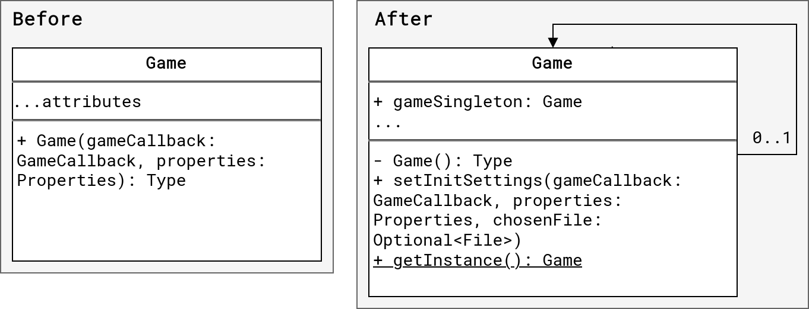
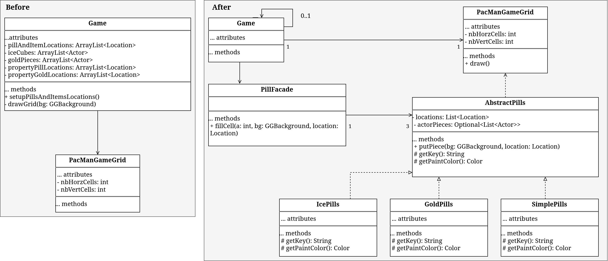
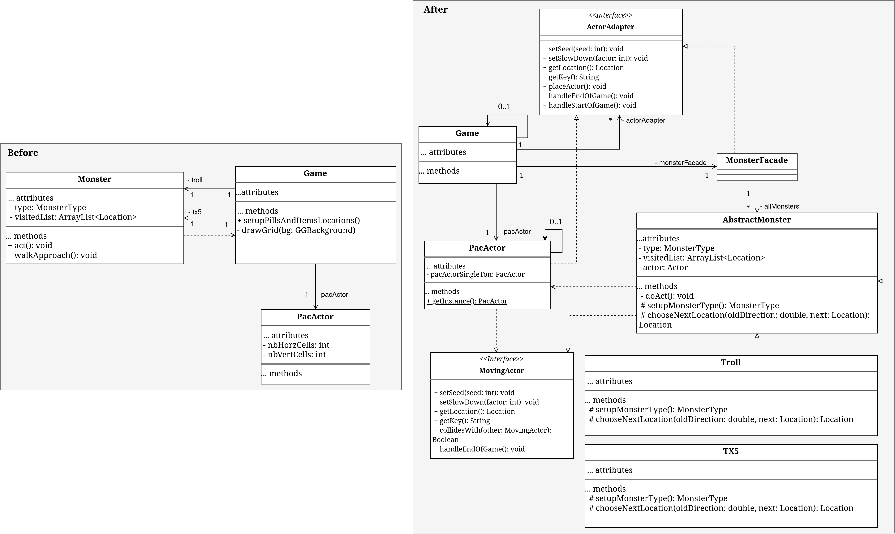

# SWEN30006 Assignment2: Report
**Group Members:**
| Name | ID | Email |
| ---- | -- | ----- |
| Tahmin Ahmed | 1146663 | tahmin@student.unimelb.edu.au |
| Duvindra Dissanayake | 1152586 | duvindrasanj@student.unimelb.edu.au |
| Sugon (Tony) Chrisjaroon | 1128883 | schristjaroo@student.unimelb.edu.au |

This report looks at a design analysis of a refactor and extension of the game
"PacMan in the MultiVerse" into a new game "PacMan in the TorusVerse" as the second assignment of the subject
SWEN30006, 2023. To reflect on the learning outcomes of the subject, both GoF
and GRASP design patterns have been put into consideration during the
refactoring process.

First, we identify the structure of the initial codebase, then we discuss the
new design decisions made for the refactor and the reasons they were made.
The following diagrams have been provided to better visualize the changes made:
- A domain class diagram for capturing the covering the domain concepts
relating to the autoplayer and game levels/maps for PacMan in the TorusVerse
- A static design model (i.e., a design class diagram) for documenting your
design relating to the autoplayer and game levels/maps for PacMan in the
TorusVerse.
- Additional static and/or dynamic design models to support P1 and P2 above as you judge useful
and appropriate

```
Page Break here
```

## Initial codebase structure
The initial codebase contains the source directories for two separate programs:
1. The source code of the simple version of "PacMan in the MultiVerse"
2. The source code of a GUI to be used as a map maker

While the task is to integrate the GUI into the PacMan game and implement the
new functionality of the TorusVerse version, simply porting the GUI into a 
potentially badly-designed codebase of the original game could make for a worse
design. Thus, to make the best results, first we will analyze the simple
version of the game and check what changes can be made.

### Simple version of the game
#### The problem
Initially, all the game logic, handling of individual variables, and a few classes
are in the `Game` class. Keeping it all in one place strongly goes against the following GRASP
principles:
1. Low Coupling - since every individual object interaction happens in the `Game` class, 
any changes made to other classes would cause a massive
impact to the entire program, thus making it harder to maintain
2. High Cohesion - The `Game` class does more than one well-defined job,
thus leaving its purpose very unfocused around separate responsibilities. This
makes it difficult to change and maintian the code; since responsibilities are
closely knit together, extending the game into the TorusVerse version could
be a potential disaster, potentially making it inevitable to write the code from scratch.
3. Creator - The object initialization for all individual monsters and PacMan
happens in the `Game` class. This makes it difficult to implement new monsters and maintain 
old ones while ensuring that the new logic is followed everywhere within the source code.

#### What changes can be made?
A table of considerations are made for all classes. For each consideration, the resulting design pattern chosen is proposed:
| Consideration to make | Pattern |
| --------------------- | ----------------- |
| Does any Class in the codebase need refactoring and simplification? | `Facade` | 
| Does any Class get an "evolution"; a new version of itself with potentially advanced features? | `Decorator` |
| Does any Class have an increasingly high amount of parameters, notably during initialization? | `Builder` |
| Should any Class adapt compatibility with any interface? | `Adapter` |
| Does any Class contain only a single shared instance | `Singleton` |
| Deos the class contain subclasses where its instantiation logic is irrelevant to where it's being used? | `Factory` |

**Note:** While no class really *needs* any patterns to be functional, the word "need" refers to any decision which is more meaningful to the semantics of the program.

#### The changes made
After going through each class, the following design decisions have been made:
| Class | Pattern | Reason |
| ----- | ------- | ------ |
| `Game` | Facade | Provides a higher-level interface for the interaction of monsters, simplifying the logic in the `Game` class |
| `Game` | Facade | Provides a higher-level interface for the interaction of Pills, simplifying the logic in the `Game` class |
| `Game` | Singleton | Used to enforce that only one game is ever created during runtime |
| `Monster` | Factory | Hide the implementation logic of each monster to let external code focus on the usage of the `Monster` rather than its initialization |
| `Monster` | Adapter | Allow polymorphic behavior between itself and `PacActor` |
| `PacActor` | Adapter | Allow polymorphic behavior between itself and `Monster` |
| `PacActor` | Singleton | Prevent any new instance to ever be created and enforce it during development time and runtime |

##### The singleton pattern on the `Game` class
Implementing this pattern for the `Game` class comes with the additional benefit of reducing dependencies between the parameters of objects and any tight coupling from the codebase. This ensures that other objects that depend on `Game` can now access a global single instance which eliminates the need to pass around the single `Game` instance explicitly. Now, any object that needs access to `Game` can just reference it using `Game.getInstance()`.

Since the same `Game` object can be referred to from anywhere, other objects relying on it will no longer need to store a reference to it. Due to this, adding new descendant classes (like new Monsters set by a new specification) will not require any kind of change in other classes. This makes the design more modular and flexible which allows for easier extension of the TorusVerse.  


##### The `PacManGameGrid` class and the Facade pattern on the `Game` class for Pills
After starting the implementation for the Facade pattern on the `Game` class to abstract away pill-related items, 
it started making sense to also extract any grid parsing functionality away from it too, 
as, by doing so, the `Game` class gets closer to performing the High-cohesion principle of GRASP.

It was decided to extract grid parsing to the `PacManGameGrid` class as it makes more sense to parse grid-related items in said class.
This is important especially for this specification, as the new functionality is strongly dependant on how the grid
is parsed. Since the logic for grid-parsing now only happens in `PacManGameGrid`, this would be the only class that 
would eventually need to be changed when porting the 2D Map Editor. This saves us (the developers) from potentially 
introducing bugs in other parts of the codebase while also contributing to it by adding the newly requested features.  


##### The singleton pattern on the `PacActor` class and the Facade pattern on the `Game` class for Monsters
The singleton pattern implemented in the `PacActor` class assisted in the proccess of implementing the Facade pattern
for the `Monster` class. The code resulted in less calls to `getInstance` from the Game class, as `PacActor`'s single
instance was now available without coupling the Game state in.

This contributes to better cohesion, thus following with a GRASP principle. If Arcade 24 (TM) ever wants to make new Monsters, they would only need to worry about the `MonsterFacade` class and its set of attributes rather than the whole game. With that same idea since, since the 
idea of the Torus effect is in the current specification, implementing it would no longer require the developers to worry about the implementation of Monsters or other unrelated aspects of the Game.


In summary, the result of refactoring with patterns is the following:
1. New monsters can be made without having to worry about any unrelated aspects of the Game logic
2. New Pills can be made without having to worry about any unrelated aspects of the Game logic
3. Now only the `PacManGameGrid` class is responsible for all aspects related to the creation of the Game Grid

The most notable advantage for this assignment is the third point (although the other two are equally
important for extensibility). Using this lowly-coupled class, we can now migrate the 2D Map Editor into the
`/pacman` source code.

### Integrating the 2D Map Editor
The 2D Map Editor comes mostly pre-implemented. It only now needs to be integrated into the `/pacman` source
code. Since the editor primarily makes the map for a custom `PacManGameGrid` instance, this was the only class
that required significant changes.

In general, the overall set of changes include:
- Ensuring the existence of a `/pacman/Game` directory 
- transferring the sprites from `2D-Map-Editor-master/data` to a new directory `/pacman/torusData` 
- Changing how the `String[] args` parameter in the `main` method of `/pacman/src/Driver` parsed the commandline
arguments
- Changing how the Game would handle the file/directory provided in the commandline arguments. This included 
safe-checks to go back to the original (refactored) version of the game.
- Changing how `PacManGameGrid` would convert the XML files to match with the original initialization of the grid
while also extending to the new functionality.

When an XML file is loaded into the program using the 2D Map Editor's `Controller.loadFile` method and the `GridModel` class, 
the map is originally stored as a 2D array containing characters, whereas the original version stored the map as
a 2D array of integers.

To resolve the disparity of using different datatypes for parsing the same map, the `PacManGameGrid` class accomplished 
two extra goals (both related to Map parsing, thus maintaining high cohesion):
1. Since the rest of the program was implemented to understand the 2D integer-array, the 2D-character-array was 
converted into a 2D integer-array.
2. It parsed the properties of the grid to now prefer the properties of the XML Grid over the `.properties` file.
This was one of our tasks from the specification.

Point `1.` could be easily done in the `PacManGameGrid` class, as it only was concerning the initialization of the grid.

Point `2.` would have been difficult to implement if not for the newly refactored version of the code. With the new version, 
instead of changing every individual object and variable to reflect the new XML file, the only method that needed to be changed 
was the default implementation of the `MovingActor.initializeLocation()` method, thus affecting every single relevant class 
without needing to change them individually. With the availability of a Game singleton, no other part of the codebase required 
restructuring and could be seamlessly called to access the new data in the `PacManGameGrid` class. 

This is a great example of the perks that come with mixing the Singleton and Adapter patterns with the polymorphism and high cohesion GRASP principles, 
proving the improvement in maintainability and scalability of the new codebase whilst also reducing the chances of human error. 


